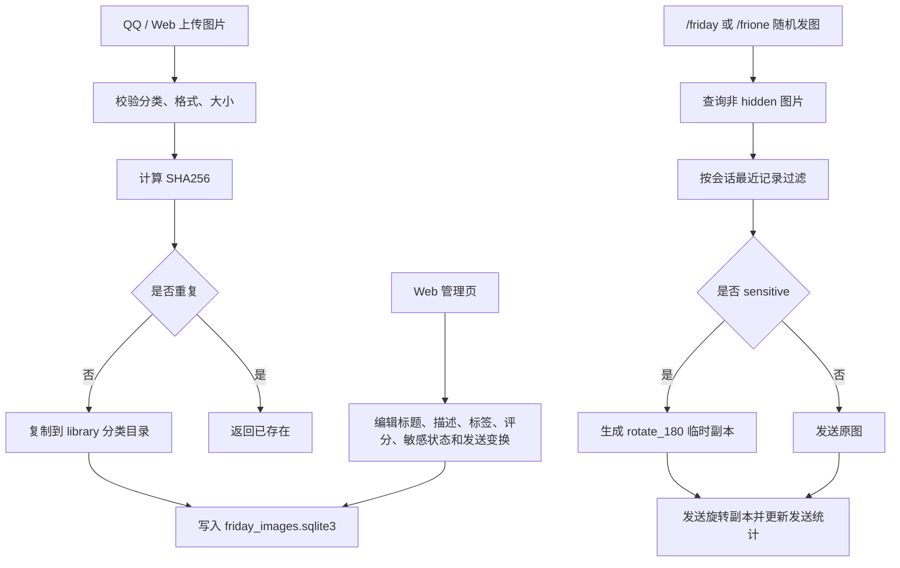

# Friday 本地图库插件

> [!NOTE]
> v1.2 将图库索引升级为 SQLite，并提供 AstrBot Plugin Page 管理页。敏感图片可在发送前生成临时旋转 180 度副本，原图不会被修改。

## 功能

| 能力 | 说明 |
|---|---|
| 随机发图 | `/friday <分类>` 或 `/frione <分类>` 从全部或指定分类随机发送 |
| 图片上传 | `/friupload <分类>` 支持当前消息附图和回复图片上传 |
| SQLite 元数据 | 维护标题、描述、标签、评分、敏感状态、发送变换、上传者和发送统计 |
| Web 管理页 | 在 AstrBot WebUI 中查看、筛选、上传和编辑图片信息 |
| 敏感图变换 | 敏感图默认生成旋转 180 度临时副本后发送 |
| 会话去重 | 同一群聊或私聊短期内优先避免连续重复 |

## 安装

> [!TIP]
> 未上架插件市场时，可以把 `astrbot_plugin_friday_image_library.zip` 上传到 AstrBot WebUI 的插件页。

1. 确认 AstrBot 已经通过 OneBot v11 reverse WebSocket 接入 NapCat。
2. 在 AstrBot WebUI 进入“插件”页面。
3. 点击右下角 `+`，选择文件上传。
4. 上传 `astrbot_plugin_friday_image_library.zip`，启用插件。
5. 在 QQ 里发送 `/frihelp` 检查指令是否可用。

> [!IMPORTANT]
> 敏感图旋转发送需要 Pillow。若 AstrBot 没有自动安装依赖，在 AstrBot 的 Python 环境中执行 `pip install pillow` 后重载插件。

## QQ 指令

| QQ 指令 | 行为 |
|---|---|
| `/friday` | 从全部可发送图片中随机发一张 |
| `/friday <分类>` | 从指定分类随机发一张 |
| `/frione` | 从全部公开图片中随机发一张 |
| `/frione <分类>` | 从指定分类随机发一张 |
| `/friupload` + 附图 | 上传到默认分类 |
| `/friupload <分类>` + 附图 | 上传到指定分类 |
| 回复图片后 `/friupload <分类>` | 保存被回复消息里的图片 |
| `/friclass` | 列出所有分类、图片数和发送次数 |
| `/frihelp` | 查看帮助 |

随机发图后会附带：

| 字段 | 说明 |
|---|---|
| 标题 | 默认来自原始文件名，可在 Web 中编辑 |
| 描述 | 默认为空，可在 Web 中编辑 |
| 标签 | 默认为空，可在 Web 中编辑 |
| 发送次数 | 每次 `/frione` 成功后自动累加 |

## Web 管理页

> [!NOTE]
> Web 管理页依托 AstrBot Plugin Pages，不新增独立端口，也不需要单独启动 Flask/FastAPI。

入口：

```text
AstrBot WebUI -> 插件 -> Friday 本地图库 -> 页面 -> gallery-admin
```

Web 页面支持：

| 功能 | 行为 |
|---|---|
| 总览 | 图片总数、分类数、累计发送次数、最近上传时间 |
| 筛选 | 按分类、可见性、关键词过滤 |
| 图片列表 | 查看缩略图、标题、描述、标签、分类、发送次数 |
| 信息编辑 | 修改标题、描述、标签、评分、敏感状态、发送变换 |
| Web 上传 | 选择分类和本地图片后上传 |
| 隐藏 | 将图片敏感状态设为 `hidden`，随机发图不会抽中 |
| 敏感图 | 将图片设为 `sensitive`，默认使用 `rotate_180` 发送变换 |

## 数据目录

```text
data/plugin_data/astrbot_plugin_friday_image_library/
  friday_images.sqlite3
  transformed/
  library/
    默认/
      20260515-180000-abcdef123456-image.jpg
    猫猫/
      20260515-180010-fedcba654321-cat.png
```

> [!WARNING]
> v1.2 启动时会自动扫描 `library/` 并写入 SQLite。如果发现旧版 `.index.json`，迁移完成后会删除该旧索引文件，但不会删除任何图片。`transformed/` 只保存可重建的临时发送副本。

## SQLite 字段

| 字段 | 说明 |
|---|---|
| `id` / `sha256` | 图片稳定 ID 和去重依据 |
| `category` | 分类 |
| `relative_path` | 相对 `library/` 的图片路径 |
| `title` / `description` / `tags_json` | 可维护信息 |
| `rating` / `safety_status` | 评分和敏感状态：`normal`、`sensitive`、`hidden` |
| `send_transform` | 发送变换：`none`、`rotate_180` |
| `uploader_id` / `source_session` | 上传来源 |
| `send_count` / `last_sent_at` | 发送统计 |

## 配置

| 配置项 | 默认值 | 说明 |
|---|---:|---|
| `default_category` | `默认` | 上传未填写分类时使用 |
| `allowed_extensions` | `jpg,jpeg,png,gif,webp` | 允许的图片扩展名 |
| `max_image_size_mb` | `20` | 单图大小上限 |
| `recent_window` | `20` | 每个会话的随机去重窗口 |
| `upload_receipt` | `true` | 上传成功后是否发送回执 |

## 流程



## 排障

> [!FAILURE]
> `/friday` 或 `/frione` 没有响应：先确认 AstrBot 的唤醒前缀仍包含 `/`，并在 WebUI 命令管理里确认命令已启用。

> [!FAILURE]
> 敏感图提示需要 Pillow：在 AstrBot 使用的 Python 环境中安装 `pillow`，然后重载插件。

> [!FAILURE]
> Web 页面不出现：确认插件目录中存在 `pages/gallery-admin/index.html`，然后在 WebUI 中重载插件。

> [!FAILURE]
> 上传提示没有检测到图片：优先使用“指令文字 + 图片”同一条消息发送；如果使用回复上传，需确认当前 OneBot 适配器会把被回复图片放进消息链。
