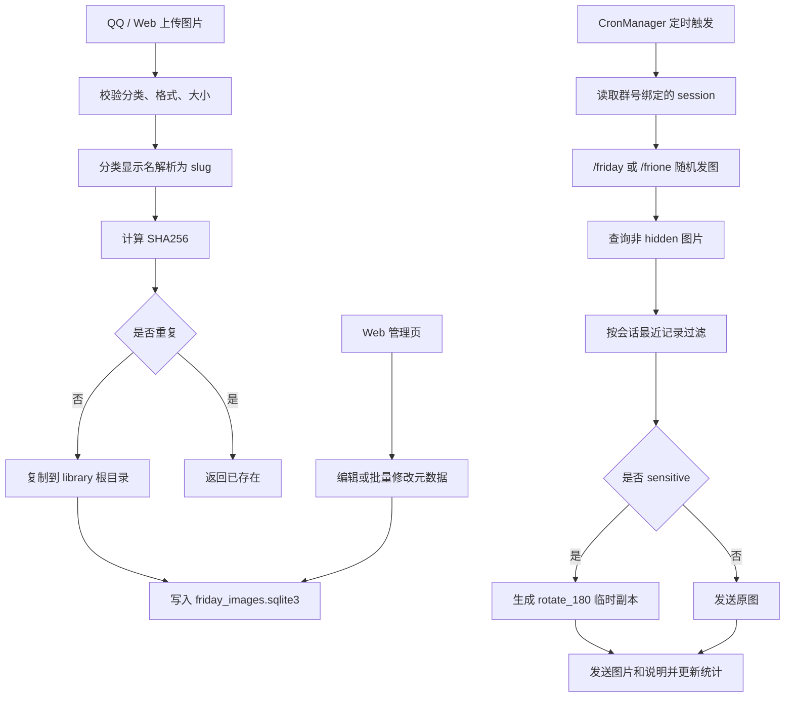

# Friday 本地图库插件

> [!NOTE]
> v1.3 将图库文件迁移为 `library/` 单文件夹存储，分类统一保存为英文 slug，同时保留中文显示名。QQ 侧新增群白名单、上传管理员、定时发图；Web 管理页支持分页、拖拽多图上传和批量操作。

## 功能

| 能力 | 说明 |
|---|---|
| 随机发图 | `/friday <分类>` 或 `/frione <分类>` 从全部或指定分类随机发送 |
| 图片上传 | `/friup <分类>` 支持当前消息附图和回复图片上传，`/friupload` 保留为别名 |
| 权限控制 | 非白名单群静默忽略，非管理员不能上传或管理定时发图 |
| SQLite 元数据 | 维护标题、描述、标签、评分、敏感状态、发送变换、上传者和发送统计 |
| Web 管理页 | 查看、筛选、无限滚动、拖拽上传、编辑、批量修改和批量删除 |
| 敏感图变换 | 敏感图默认生成旋转 180 度临时副本后发送，原图不改动 |
| 定时发图 | 使用 AstrBot CronManager 按 crontab 向已绑定群主动发送随机图 |

## 安装

> [!TIP]
> 未上架插件市场时，可以把 `astrbot_plugin_friday_image_library.zip` 上传到 AstrBot WebUI 的插件页。

1. 确认 AstrBot 已经通过 OneBot v11 reverse WebSocket 接入 NapCat。
2. 在 AstrBot WebUI 进入“插件”页面。
3. 点击右下角 `+`，选择文件上传。
4. 上传 `astrbot_plugin_friday_image_library.zip`，启用插件。
5. 在 QQ 里发送 `/frihelp` 检查指令是否可用。

> [!IMPORTANT]
> 敏感图旋转发送需要 Pillow。若 AstrBot 没有自动安装依赖，在 AstrBot 的 Python 环境中执行 `pip install Pillow>=10.0.0` 后重载插件。

> [!TIP]
> 中文分类转英文 slug 优先使用 `pypinyin`。依赖缺失时会用 Unicode 码位 fallback，不会把所有中文分类坍缩成同一个 `cat_default`。

## QQ 指令

| QQ 指令 | 行为 |
|---|---|
| `/friday` | 从全部可发送图片中随机发一张 |
| `/friday <分类>` | 从指定分类随机发一张，分类可填中文显示名或英文 slug |
| `/frione` | 从全部公开图片中随机发一张 |
| `/frione <分类>` | 从指定分类随机发一张 |
| `/friup` + 附图 | 上传到默认分类 |
| `/friup <分类>` + 附图 | 上传到指定分类 |
| `/friupload <分类>` | `/friup` 的兼容别名 |
| 回复图片后 `/friup <分类>` | 保存被回复消息里的图片 |
| `/friclass` | 列出所有分类、图片数和发送次数 |
| `/frischedule bind` | 在当前群绑定定时发图会话 |
| `/frischedule status` | 查看定时发图配置、任务和绑定状态 |
| `/frischedule test` | 向当前已绑定群发送一次测试图 |
| `/frischedule reload` | 重载定时发图配置 |
| `/frihelp` | 查看帮助 |

随机发图会把图片和说明合并成同一条消息，说明字段包括：

| 字段 | 说明 |
|---|---|
| 标题 | 默认来自原始文件名，可在 Web 中编辑 |
| 描述 | 默认为空，可在 Web 中编辑 |
| 标签 | 默认为空，可在 Web 中编辑 |
| 发送次数 | 每次成功发送后自动累加 |

## Web 管理页

> [!NOTE]
> Web 管理页依托 AstrBot Plugin Pages，不新增独立端口，也不需要单独启动 Flask/FastAPI。

入口：

```text
AstrBot WebUI -> 插件 -> Friday 本地图库 -> 页面 -> gallery-admin
```

| 功能 | 行为 |
|---|---|
| 总览 | 图片总数、分类数、累计发送次数、最近上传时间 |
| 筛选 | 按分类、敏感状态、关键词过滤 |
| 无限滚动 | 每次加载 60 张，滚动到底部继续加载 |
| 图片列表 | 查看缩略图、标题、描述、标签、分类、发送次数 |
| 信息编辑 | 修改标题、描述、标签、评分、敏感状态、发送变换 |
| 拖拽上传 | 拖入多张图片后逐张上传到指定分类 |
| 批量修改 | 多选图片后批量设置敏感状态和发送变换 |
| 批量删除 | 多选图片后删除数据库记录、发送历史和本地文件 |

## 数据目录

```text
data/plugin_data/astrbot_plugin_friday_image_library/
  friday_images.sqlite3
  schedule_sessions.json
  transformed/
  library/
    20260515-180000-abcdef123456-image.jpg
    20260515-180010-fedcba654321-cat.png
```

> [!WARNING]
> v1.3 启动时会把旧版 `library/<分类>/图片` 迁移到扁平 `library/` 根目录。SQLite 中的 `images.category` 会保存英文 slug，`categories.display_name` 保留中文分类名。

## SQLite 字段

| 表 | 字段 | 说明 |
|---|---|---|
| `images` | `id` / `sha256` | 图片稳定 ID 和去重依据 |
| `images` | `category` | 分类 slug |
| `images` | `relative_path` | 相对 `library/` 的图片文件名 |
| `images` | `title` / `description` / `tags_json` | 可维护信息 |
| `images` | `rating` / `safety_status` | 评分和敏感状态：`normal`、`sensitive`、`hidden` |
| `images` | `send_transform` | 发送变换：`none`、`rotate_180` |
| `images` | `uploader_id` / `source_session` | 上传来源 |
| `images` | `send_count` / `last_sent_at` | 发送统计 |
| `categories` | `slug` / `display_name` | 英文分类 ID 和中文显示名 |
| `schema_version` | `flat_migration` | 扁平目录迁移标记 |

## 配置

| 配置项 | 默认值 | 说明 |
|---|---:|---|
| `default_category` | `默认` | 上传未填写分类时使用 |
| `allowed_extensions` | `jpg,jpeg,png,gif,webp` | 允许的图片扩展名 |
| `max_image_size_mb` | `20` | 单图大小上限 |
| `recent_window` | `20` | 每个会话的随机去重窗口 |
| `upload_receipt` | `true` | 上传成功后是否发送回执 |
| `allowed_group_ids` | `[]` | 允许使用图库指令的群号，留空表示不限制 |
| `admin_qq_numbers` | `[]` | 可上传和管理定时发图的 QQ 号，留空表示不限制 |
| `scheduled_send_enabled` | `false` | 是否启用定时发图 |
| `scheduled_send_cron` | `0 9 * * *` | 5 段 crontab，时区 `Asia/Shanghai` |
| `scheduled_send_group_ids` | `[]` | 定时发图目标群号 |
| `scheduled_send_category` | `""` | 定时发图分类，留空表示全部分类 |

> [!IMPORTANT]
> 定时发图配置了群号后，还需要管理员在每个目标群执行 `/frischedule bind`。AstrBot 主动发送需要 `unified_msg_origin`，插件会把群号和会话 ID 保存到 `schedule_sessions.json`。

## 流程



## 排障

> [!FAILURE]
> `/friday` 或 `/frione` 没有响应：先确认 AstrBot 的唤醒前缀仍包含 `/`，并在 WebUI 命令管理里确认命令已启用；如果配置了 `allowed_group_ids`，确认当前群在列表内。

> [!FAILURE]
> 上传提示“仅管理员可上传”：把发送者 QQ 号加入 `admin_qq_numbers`，或清空该配置表示不限制。

> [!FAILURE]
> 敏感图提示需要 Pillow：在 AstrBot 使用的 Python 环境中安装 `Pillow>=10.0.0`，然后重载插件。

> [!FAILURE]
> Web 页面不出现：确认插件目录中存在 `pages/gallery-admin/index.html`，然后在 WebUI 中重载插件。

> [!FAILURE]
> 定时发图没有发送：确认 `scheduled_send_enabled=true`、`scheduled_send_group_ids` 已配置、目标群已执行 `/frischedule bind`，再用 `/frischedule test` 验证主动发送链路。

> [!FAILURE]
> 上传提示没有检测到图片：优先使用“指令文字 + 图片”同一条消息发送；如果使用回复上传，需确认当前 OneBot 适配器会把被回复图片放进消息链。
