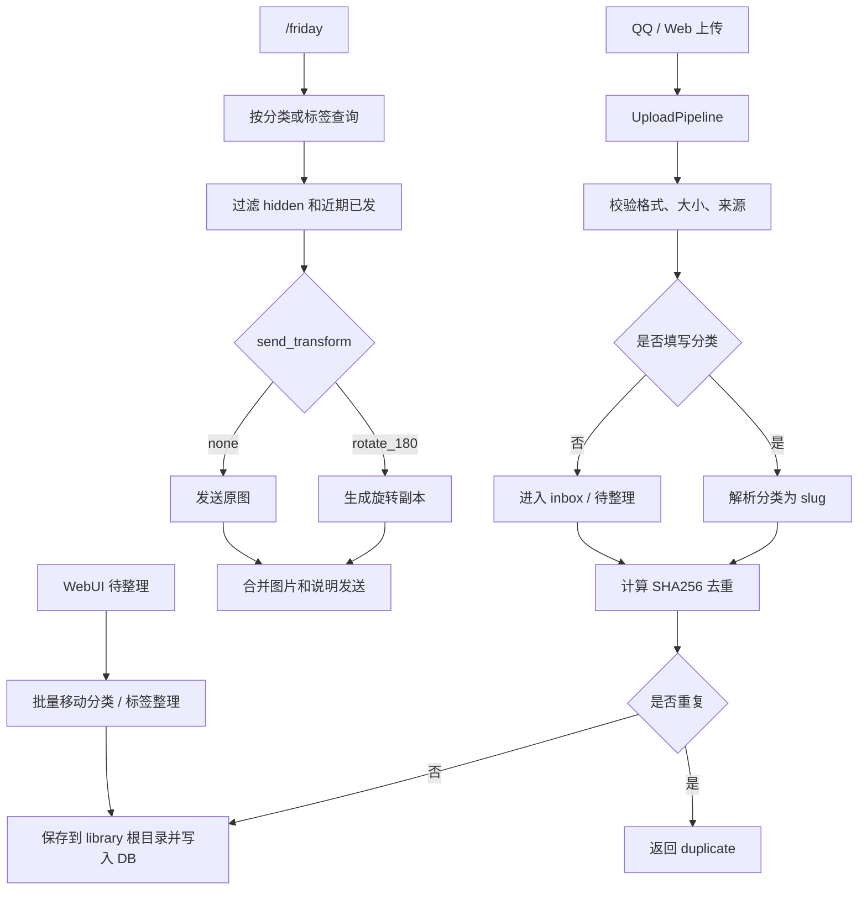

# Friday 本地图库插件

> [!NOTE]
> v1.4.2 是产品化重构后的分类修正版：QQ 侧收敛为 `/friday`、`/friup`、`/frihelp`，插件配置改为 AstrBot `_conf_schema.json` 分层对象，QQ/Web 上传统一进入 upload pipeline。未指定分类的图片会进入 `inbox` 系统分类，显示名为“待整理”。本版本修复空分类不可见、空分类误报不存在、分类显示名可重复的问题。

## 功能

| 能力 | 说明 |
|---|---|
| 日常发图 | `/friday [分类\|#标签] [数量]` 从全部、分类或标签随机发图 |
| 统一上传 | `/friup [分类]` 或 Web 拖拽上传都走同一条 pipeline |
| 待整理区 | 上传未填分类时进入 `inbox`，WebUI 可快捷筛选和批量整理 |
| 权限控制 | 群白名单静默忽略；管理员白名单控制上传和定时管理 |
| Web 管理页 | 无限滚动、拖拽多图、编辑、批量状态、批量移动分类、批量标签、批量删除 |
| 分类管理 | WebUI 支持新建分类、重命名显示名、合并分类 |
| 敏感图变换 | `send_transform=rotate_180` 的图片发送前生成旋转副本，原图保持不变 |
| 定时发图 | 使用 AstrBot CronManager 按 crontab 向已绑定群主动发送随机图 |

## 安装

> [!TIP]
> 未上架插件市场时，可以把 `astrbot_plugin_friday_image_library.zip` 上传到 AstrBot WebUI 的插件页。

1. 确认 AstrBot 已经通过 OneBot v11 reverse WebSocket 接入 NapCat。
2. 在 AstrBot WebUI 进入“插件”页面。
3. 点击右下角 `+`，选择文件上传。
4. 上传 zip 包并启用插件。
5. 在 QQ 里发送 `/frihelp` 检查指令是否可用。

> [!IMPORTANT]
> 敏感图旋转发送需要 Pillow。若 AstrBot 没有自动安装依赖，在 AstrBot 的 Python 环境中执行 `pip install Pillow>=10.0.0` 后重载插件。

## QQ 指令

### 可见指令

| QQ 指令 | 行为 |
|---|---|
| `/friday` | 从全部可发送图片中随机发一张 |
| `/friday 分类名` | 从指定分类随机发一张，分类可填中文显示名或英文 slug |
| `/friday #标签` | 从指定标签随机发一张 |
| `/friday 分类名 数量` | 一次发送多张，最大数量由 `send.max_batch_count` 控制 |
| `/friup` + 附图 | 上传到待整理区 |
| `/friup 分类名` + 附图 | 上传到指定分类 |
| `/frihelp` | 查看精简帮助 |

### 兼容指令

| QQ 指令 | 状态 |
|---|---|
| `/frione` | 保留为 `/friday` 兼容别名 |
| `/friupload` | 保留为 `/friup` 兼容别名 |
| `/friclass` | 保留分类列表兼容入口 |
| `/frischedule bind/status/test/reload` | 管理员定时发图管理入口 |

## 配置

> [!NOTE]
> 插件设置统一放在 AstrBot 插件配置中。WebUI 只做图片、分类和待整理区管理。

| 分组 | 配置项 | 默认值 | 说明 |
|---|---|---:|---|
| `basic` | `default_category` | `默认` | 兼容旧逻辑的默认分类 |
| `permission` | `allowed_group_ids` | `[]` | 允许使用图库指令的群号，留空表示不限制 |
| `permission` | `admin_qq_numbers` | `[]` | 可上传和管理定时发图的 QQ 号，留空表示不限制 |
| `upload` | `allowed_extensions` | `jpg,jpeg,png,gif,webp` | 允许的图片扩展名 |
| `upload` | `max_image_size_mb` | `20` | 单图大小上限 |
| `upload` | `upload_receipt` | `true` | 上传成功后是否发送回执 |
| `upload` | `inbox_category` | `inbox` | 未指定分类时使用的待整理系统分类 |
| `send` | `recent_window` | `20` | 每个会话的随机去重窗口 |
| `send` | `max_batch_count` | `3` | `/friday` 一次最多发送数量 |
| `schedule` | `enabled` | `false` | 是否启用定时发图 |
| `schedule` | `cron` | `0 9 * * *` | 5 段 crontab，时区 `Asia/Shanghai` |
| `schedule` | `group_ids` | `[]` | 定时发图目标群号 |
| `schedule` | `category` | `""` | 定时发图分类，留空表示全部分类 |

> [!TIP]
> v1.4.0 会读取旧版 flat key 并迁移到嵌套配置，随后调用 `save_config()`。旧字段在 `_conf_schema.json` 中保留为 `invisible` 一个版本，用于平滑升级。

## Web 管理页

入口：

```text
AstrBot WebUI -> 插件 -> Friday 本地图库 -> 页面 -> gallery-admin
```

| 功能 | 行为 |
|---|---|
| 总览 | 图片总数、分类数、累计发送次数、待整理数量 |
| 筛选 | 按分类、敏感状态、关键词过滤，支持一键进入待整理 |
| 上传 | 拖拽或选择多张图片；分类留空时进入待整理 |
| 图片编辑 | 修改标题、描述、标签、评分、敏感状态、发送变换 |
| 批量整理 | 多选后批量移动分类、添加/移除/替换标签 |
| 批量状态 | 多选后批量设置敏感状态和发送变换 |
| 分类管理 | 新建分类、重命名显示名、合并分类 |
| 批量删除 | 删除数据库记录、发送历史和本地文件 |

## 数据目录

```text
data/plugin_data/astrbot_plugin_friday_image_library/
  friday_images.sqlite3
  schedule_sessions.json
  transformed/
  library/
    20260515-180000-abcdef123456-image.jpg
    20260515-180010-fedcba654321-cat.png
```

> [!WARNING]
> v1.3 起图库文件迁移为 `library/` 单文件夹存储。SQLite 中的 `images.category` 保存英文 slug，`categories.display_name` 保留展示名。

## 流程



## 排障

> [!FAILURE]
> `/friday` 没有响应：先确认 AstrBot 的唤醒前缀仍包含 `/`，并在 WebUI 命令管理里确认命令已启用；如果配置了 `permission.allowed_group_ids`，确认当前群在列表内。

> [!FAILURE]
> 上传提示“仅管理员可上传”：把发送者 QQ 号加入 `permission.admin_qq_numbers`，或清空该配置表示不限制。

> [!FAILURE]
> 上传后出现在待整理：这是 v1.4.0 的默认行为。使用 `/friup 分类名` 或 Web 上传分类输入框可直接指定分类。

> [!FAILURE]
> 群聊发图出现 NapCat `NodeIKernelMsgService/sendMsg` 超时：v1.4.1 起图库 QQ 指令会直接发送消息，并把随机图拆成“图片一条、说明一条”，绕开 AstrBot 全局引用回复和 @ 装饰。若仍失败，继续检查图片大小、QQ 客户端状态和 NapCat 连接。

> [!FAILURE]
> 敏感图没有旋转：确认图片的 `send_transform` 是 `rotate_180`，并确认 AstrBot 环境已经安装 Pillow。

> [!FAILURE]
> 定时发图没有发送：确认 `schedule.enabled=true`、`schedule.group_ids` 已配置、目标群已执行 `/frischedule bind`，再用 `/frischedule test` 验证主动发送链路。
